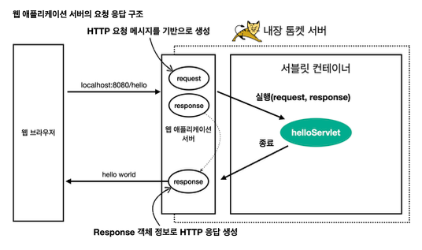

# 웹 서버, 웹 애플리케이션 서버

### 웹에선 모든것이 HTTP이다.
- 웹에서 대부분의 데이터는 HTTP 프로토콜을 준수하게 된다.
- 서버간의 전송에서도 HTTP가 사용된다.

### 웹 서버
- HTTP 기반으로 동작
- 클라이언트가 `HTTP 요청`을 하면 웹 서버는 `HTTP 응답`을 함
- 이때 응답의 종류로 정적파일들이 해당 됨.
- 대표적으로 `NginX`, `Apache` 

### 웹 애플리케이션 서버 (WAS - Web Application Server)
- HTTP 기반으로 동작
- 웹 서버 기능 + 프로그램 수행
- 프로그램 코드를 실행할 수 있으므로 응답으로는 `Jsp`, `스프링`, `동적 Html파일`, `json` 등이 이에 해당 됨.
- 대표적으로 `Tomcat`, `Jetty`

### 웹 서버 vs 와스 서버
- 둘의 경계는 모호하나 WAS가 프로그램 로직 실행에 더 특화 되어 있음.
- 하지만 was가 모든 일을 처리하면 과부화가 우려됨.
- 정적 리소스 제공보다 프로그램 로직 실행이 중요.
- was 장애시 서버 점검 및 서버 장애에 대한 안내 문구 표출조차 불가능해짐. 

### 타협점

# 서블릿

### 서블릿이란? 
- **클라이언트의 요청을 처리하고, 그 결과를 반환하는 Servlet 클래스의 구현 규칙을 지킨 자바 웹 프로그래밍 기술**

### 서블릿의 동작방식
- 사용자의 http 요청을 파싱, 빈 응답객체를 생성
- 요청 (/hello)에 알맞은 서블릿 (`doGet /hello)`)를 찾아줌
- 비즈니스 로직 수행 후, 빈 응답객체에 결과물을 담아서 응답

### 서블릿 컨테이너
- 서블릿을 관리해주는 컨테이너, tomcat이 대표적 서블릿 컨테이너
- 서블릿 클래스를 로딩하여 인스턴스화하고,초기화 메소드를 호출하고, 요청이 들어오면 적절한 서블릿 메소드를 호출
- 서블릿 객체의 생성, 초기화, 호출, 종료, 생명주기를 관리함.
- 싱글톤으로 관리됨

   
# 동시 요청 - 멀티 쓰레드

# HTML, HTTP API, CSR, SSR

# 자바 백엔드 웹 기술 역사

