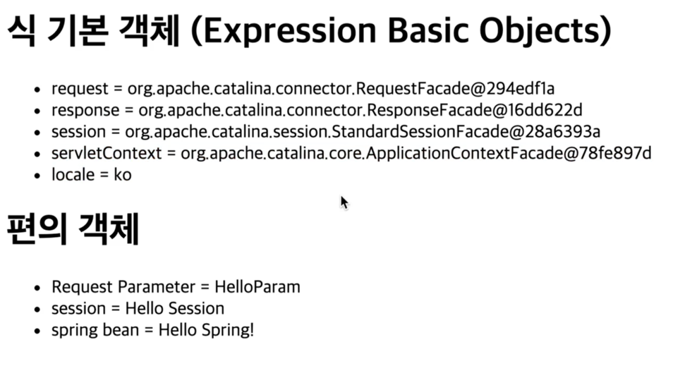

# 타임리프 기본 기능

### 타임리프 소개
- SSR
- 간단하게 빨리 만들기엔 아주 좋은 기능입니다.
- 백엔드 개발자도 jsp나 타임리프 둘중에 하나 정도는 알고 있길 권장.
- 내츄럴 템플릿 
  - 순수 HTML을 유지하면서 뷰 템플릿도 사용할 수 있는 타임리프의 특징. 
  - 순수 HTML을 최대한 유지하는 특징이 있습니다.
  - 그렇기 때문에 브라우저에서 그냥 열어도 내용을 확인 할 수 있습니다.
- 타임리프 사용 선언을 하려면..
  - `<html xmlns:th="http://www.thymeleaf.org">`을 위에 적어주면 됩니다.

### 텍스트 - text, utext
- `<th:text>`
  - ex) `<span th:text="${data}">`
  - ex) `[[${data}]]`
- 컨텐츠 안에서 직접 데이터를 출력 (이스케이프 적용)
- `<th:utext>`
  - ex) `<span th:utext="${data}">`
  - ex) `[(${data})]`
- 컨텐츠 안에서 직접 데이터를 출력 (이스케이프 미적용)

### HTML Entity과 이스케이프
- HTML은 `<`을 태그의 시작점으로 인식합니다, 따라서 `<`을 문자로 인식하는 방법이 필요했고 이를 가능하게 해준것이 HTML 엔티티입니다.
- `<` -> `&lt` 로 바꿔서 출력하게 되는데 이런 특수문자를 HTML 엔티티로 바꾸는 걸 **이스케이프**라고 합니다
- 타임리프의 `th:text`는 기본적으로 이런 기능을 제공합니다
- [HTML Entity List](https://lynmp.com/ko/article/na4022da3d633f943a)

### inline
- thymeleaf가 렌더링 하지 않게 합니다.
- ex) `<span th:inline="none">`

### 변수 - SpringEL
- model의 데이터 출력
  - 기본
    - `model.addAttribute("user", userA);` 
    - `${user.username}`, `${user['username']}`, `${user.getUsername()}`
  - 배열
    - `model.addAttribute("users", list);` 
    - `${users[0].username}`, `${users[0]['username']}`, `${users[0].getUsername()}`
  - Map
    - `model.addAttribute("userMap", map);` 
    - `${userMap['userA'].username}`, `${userMap['userA']['username']}`, `${userMap['userA'].getUsername()}`
```html
<ul>Object
    <li>${user.username} = <span th:text="${user.username}"></span></li>
    <li>${users[0].username} = <span th:text="${users[0].username}"></span></li>
    <li>${userMap['userA'].username} = <span th:text="${userMap['userA'].username}"></span></li>
</ul>
```
- 변수 만들기
  - `th:with`
```html
<div th:with="first=${users[0]}">
    <p>처음 사람의 이름은 <span th:text="${first.username}"></span></p>
</div>
```

### 기본 객체들
- 타임리프가 편의상 제공하는 기본 객체들
```java
@GetMapping("/basic-objects")
public String basicObjects(HttpSession session) {
    session.setAttribute("sessionData", "Hello Session");
    return "basic/basic-objects";
}
```
```html
<h1>식 기본 객체 (Expression Basic Objects)</h1>
<ul>
    <li>request = <span th:text="${#request}"></span></li>
    <li>response = <span th:text="${#response}"></span></li>
    <li>session = <span th:text="${#session}"></span></li>
    <li>servletContext = <span th:text="${#servletContext}"></span></li>
    <li>locale = <span th:text="${#locale}"></span></li>
</ul>

<h1>편의 객체</h1>
<ul>
    <li>Request Parameter = <span th:text="${param.paramData}"></span></li>
    <li>session = <span th:text="${session.sessionData}"></span></li>
    <li>spring bean = <span th:text="${@helloBean.hello('Spring!')}"></span></li>
</ul>
```

### 유틸리티 객체와 날짜

### URL 링크

### 리터럴

### 연산

### 속성 값 설정

### 반복

### 조건부 평가

### 주석

### 블록

### 자바스크립트 인라인

### 템플릿 조각

### 템플릿 레이아웃1

### 템플릿 레이아웃2

